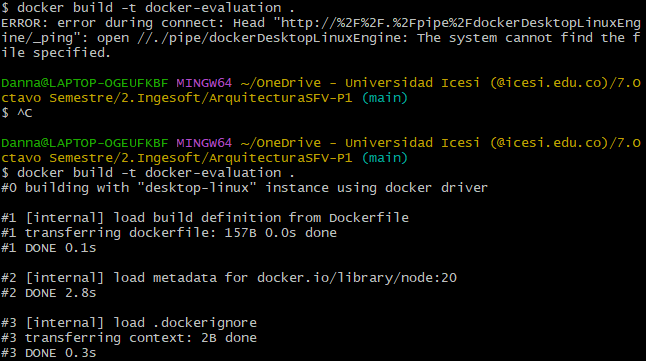
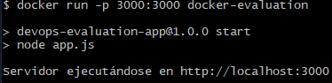
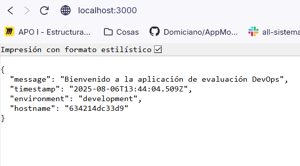

# ArquitecturaSFV-P1

# Evaluación Práctica - Ingeniería de Software V

## Información del Estudiante
- **Nombre:** Danna Valentina López Muñoz
- **Código:** A00395625
- **Fecha:** 6 de agosto de 2025

## Resumen de la Solución
Sobrevivir a base de las diapositivas y Google para poder dockerizar una aplicación de node, ya que poco y nada se de docker. :)

## Dockerfile
Lo que hice fue revisar en Google como crear un Dockerfile para una aplicación nodejs y una vez revise al menos 3 páginas, empece a escribir el Dockerfile, una vez que tenía este archivo procedí a construir la imagen con el comando 

´´
docker build -t docker-evaluation .
´´

Al principio me fallo, pero, una vez abrí Docker Desktop se soluciono el error de conexión.

Una vez que se termino la construcción de la imagen procedí a ejecutar un contenedor de esa imagen con el siguiente comando:

´´
docker run -p 3000:3000 docker-evaluation
´´

Ya que el contenedor funciono fui a http://localhost:3000 y mire que si mostrará el mensaje de bienvenida de la aplicación

Funciono así que lo deje así y me puse a ver los otros puntos como actividad de estudio porque no voy a alcanzar a subirlos en el tiempo que queda y lo mucho que tengo que investigar

## Script de Automatización
[Describe cómo funciona tu script y las funcionalidades implementadas]

## Principios DevOps Aplicados
1. [Principio 1]
2. [Principio 2]
3. [Principio 3]

## Captura de Pantalla
[Incluye al menos una captura de pantalla que muestre tu aplicación funcionando en el contenedor]

## Mejoras Futuras
Saber del tema desde antes de ponerlo en práctica :)
Escribir más rápido
Perdón pero no se me ocurre un tercero, el mayor problema fue el primero

## Instrucciones para Ejecutar
Descargar el repo y correr el comando de docker run que escribi anteriormente.
